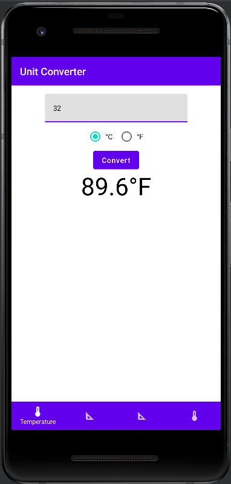
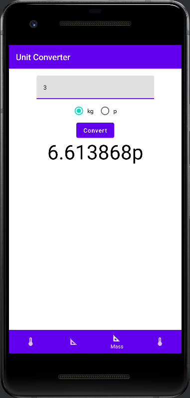
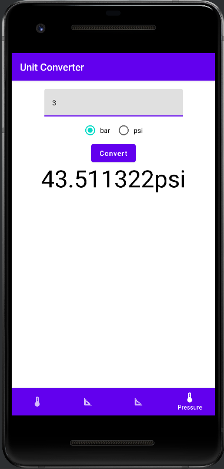

# cn333as4
นายวีรภัทร ลีลาวิทยานนท์ 6210612823 

DEMO:
https://youtu.be/8F--E9cDHOw 

1.Temperature (เปลี่ยนจาก ฟาเรนไฮต์ เป็น เซลเซียส) 
 

2.Distance (เปลี่ยนจาก เมตร เป็น ไมล์) 
 

3.Mass (เปลี่ยนจาก กิโลกรัม เป็น ปอนด์) 
 

4.Pressure (เปลี่ยนจาก บาร์ เป็น psi)  
 
